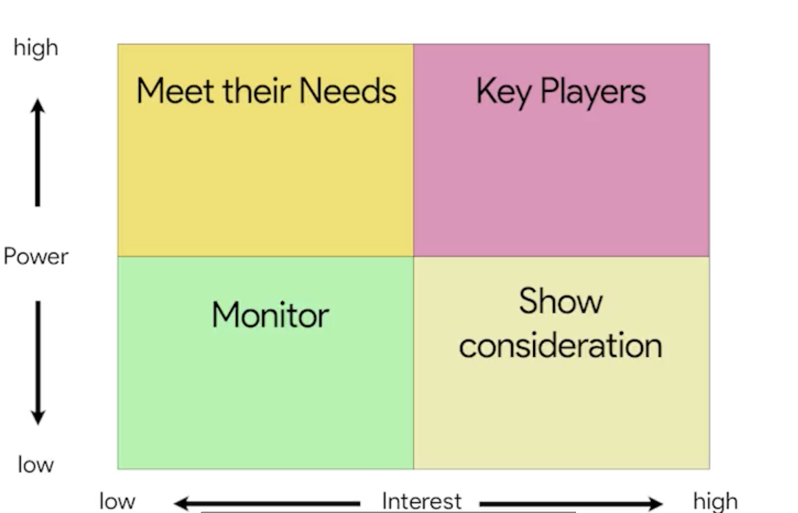
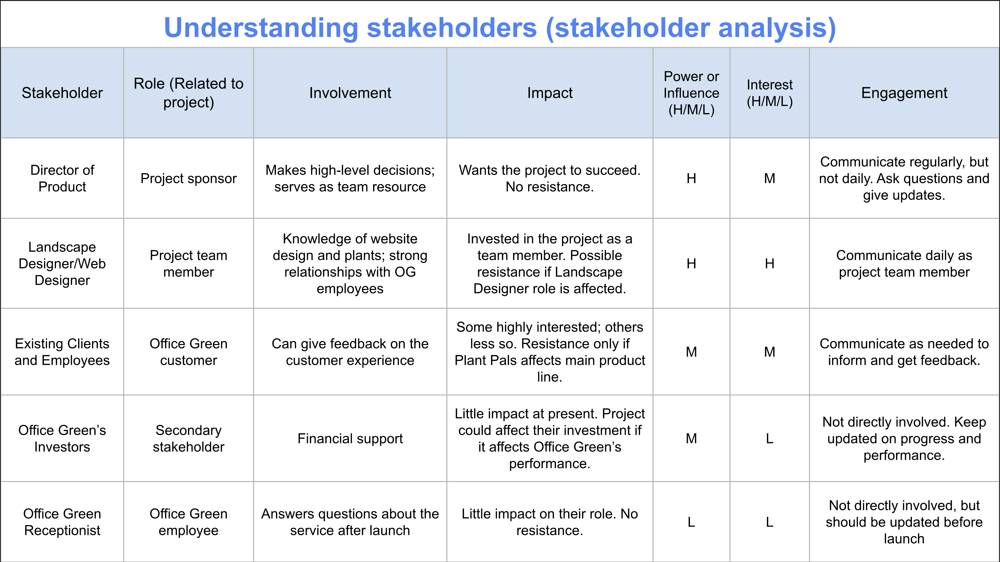

# Introduction: Working effectively with stakeholders

Stakeholders are the people who have an interest in and affected by the project's completion and success. They can be internal or external to the organization.

# Choosing a project team

When choosing a project team, consider the following:
- Requried roles
- Team size
- Necessary skills
- Availability
- Motivation

# Defining project roles

Project roles are the responsibilities and tasks that team members are expected to perform.
- Project sponsor
- Team members
- Customers and Users
- Stakeholders
- Project manager

## Project sponsor

Project sponsor is the person who's accountable for the project and who ensure the project delivers the aggred upon business benefits.

## Team members

Team members are the people doing the work and making thinngs happend.

## Customers

The people will get some value from a successfully landed project.

## Users

The people that use the product produced by your project.

## Stakeholders

Anyone involved in the project who has a vested interest in the project's success.

## Project manager

THe person who plans, organizes, and oversees the whole project.

# Completing a stakeholder analysis

Primary stakeholders are people who will benefit directly from the project's completion, while secondary stakeholders are indirectly impacted by the project's success.

## Conducting a stakeholder analysis

There are three key to kick off a stakeholder analysis:
- Make a list of all the stakeholders
- Determine the level of interest and influence of each stakeholder
- Access stakeholder' ability to participate and then find ways to involve them

Two factors are determined on a stakeholder power grid:
- Influence
- Interest

## Visualizing your analysis

**Quadrant 1: High Influence, High Interest** - Stakeholders here, such as project sponsors and key executives, have significant impact and interest in the project. They should be kept well-informed, involved in decision-making, and have their concerns addressed promptly through regular communication and tailored updates.

**Quadrant 2: High Influence, Low Interest** - These stakeholders, like senior managers, have high influence but less interest in daily details. They require executive summaries focusing on project impact and periodic updates on major milestones and changes.

**Quadrant 3: Low Influence, High Interest** - Stakeholders with high interest but low influence need regular updates on project progress and risks. Their feedback should be sought to ensure their perspective is considered.

**Quadrant 4: Low Influence, Low Interest** - Stakeholders with minimal influence and interest, such as lower-level employees, should receive general updates without overwhelming details. Communication should be minimal to keep them aware without distracting from their regular duties.

## Generate stakeholder buy-in

After organizing and assessing stakeholders, it's crucial to determine whose buy-in is essential, whose requirements need the most attention, and the level of communication each stakeholder requires. Securing key stakeholder buy-in is vital to prevent the project from being deprioritized or under-resourced. Tips for achieving this include:

- Aligning the project's work with the stakeholder's goals.
- Demonstrating how the project supports the goals of the stakeholder's department or team.
- Listening to stakeholder feedback and incorporating it into the project where appropriate.
- Managing expectations by providing a realistic view of the team's capabilities, avoiding over-promising and under-delivering.

# Stakeholder interviews

Suggested questions for stakeholders
- What are your most important priorities/goals?
- How will this initiative/project support you and your most important priorities?
- What role would you like to play within this initiative/project?
- Here’s how I plan to keep people informed; does that work for you?
- What can I clarify for you?
- What are your expectations? What would you like for the project to accomplish?
- What would success look like for you?
- Who else do you recommend I reach out to about this initiative?
- What information or insights do you have that might be challenging for me to find?
- Where do you see me getting support for this initiative? Facing resistance?
- What additional thoughts/questions do you have?

# Completing a stakeholder analysis and power grid

# Elements of RACI chart

A RACI chart helps to define roles and responsibilities for individuals or teams to ensure work gets done effectively.

There are four elements of a RACI chart:
- Responsible: those doing the work to complete the task
- Accountable: those making sure the works get done
- Consulted: those giving feedback, like subject matter experts or decision makers
- Informed: those just needing to know the final decision or task is completed

Pro-tip: use roles rather than names in the RACI chart.
This helps to ensure that the RACI chart is not biased towards any one individual.

Write down the tasks in the RACI chart.
Make sure to include all the tasks that are required to complete the project.

# The importnace and use of RACI charts in project management

- Definition and Structure: RACI charts clarify stakeholder roles, helping maintain control over project responsibilities.
- Workload Balance: By tallying responsibilities, project managers can avoid overloading team members and prevent single points of failure, ensuring a balanced workload.
- Implementation: After creating a RACI chart, share it with stakeholders for buy-in and sign-off to set clear expectations and align responsibilities. Documenting acknowledgment helps avoid misunderstandings.
- When to Use: RACI charts are beneficial for complex projects with many stakeholders. For small projects, they might slow progress, but creating one can still enhance understanding and project management skills.

Overall, RACI charts streamline communication and decision-making, contributing to effective project management.

# Why project-fail: Initiation misteps

Key points to avoid project failure:
- Unclear Expectations: Failing to define the project's end goals, deliverables, schedule, budget, and stakeholders can lead to failure. It's crucial to ask essential questions and document decisions early on.

- Unrealistic Expectations: Agreeing to unrealistic deadlines or deliverables can set a project up for failure. It's important to understand project requirements before committing to timelines.

- Miscommunication: Effective communication is vital. Missteps include not sharing information timely, omitting important details, or not reaching the right stakeholders. A RACI chart can help manage communication strategies.

- Lack of Resources: Proper planning is needed to ensure team members, budget, and materials are available. Miscalculating expenses or over-tasking team members can lead to project issues.

- Scope Creep: Uncontrolled changes to the project scope can cause failure. It's important to document scope changes and assess their impact on schedule, budget, and quality.

The key takeaway is that clarifying expectations around communication, resources, and scope during the initiation phase increases the likelihood of project success. Even with best practices, failures can occur, but they offer opportunities for learning and improvement.
